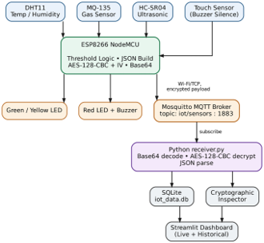
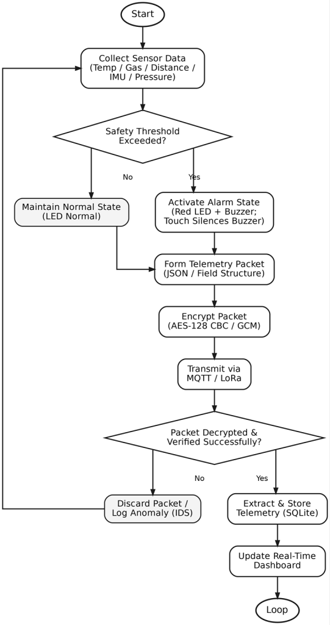
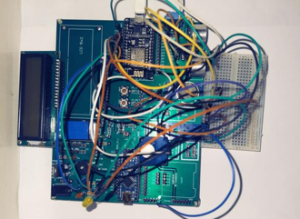
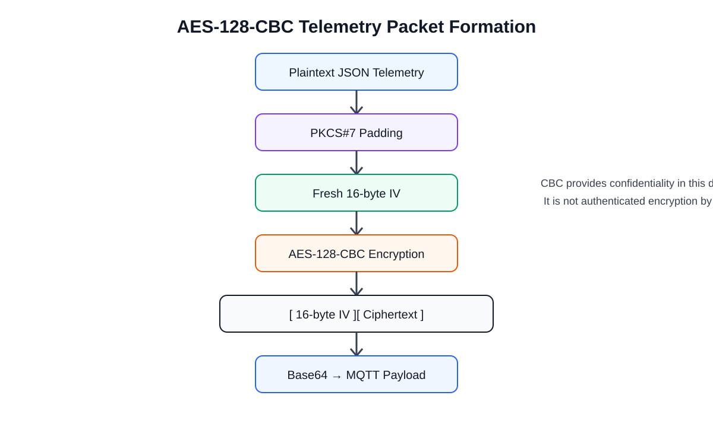
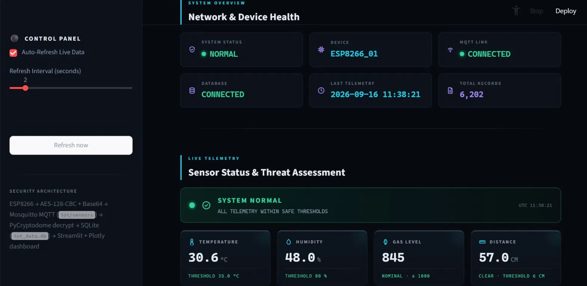
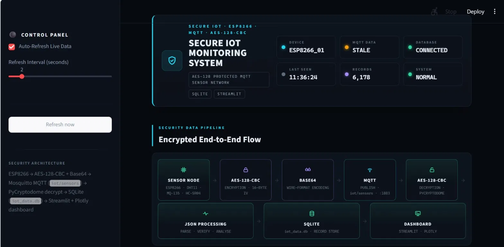
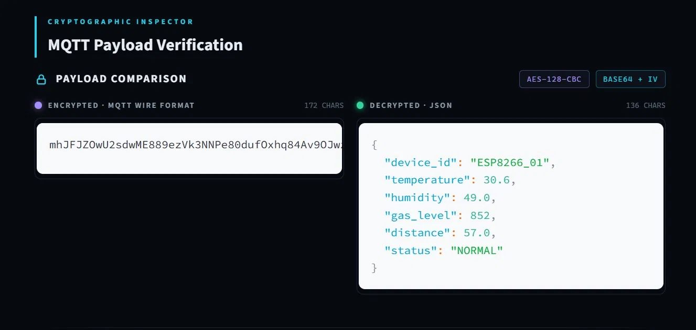
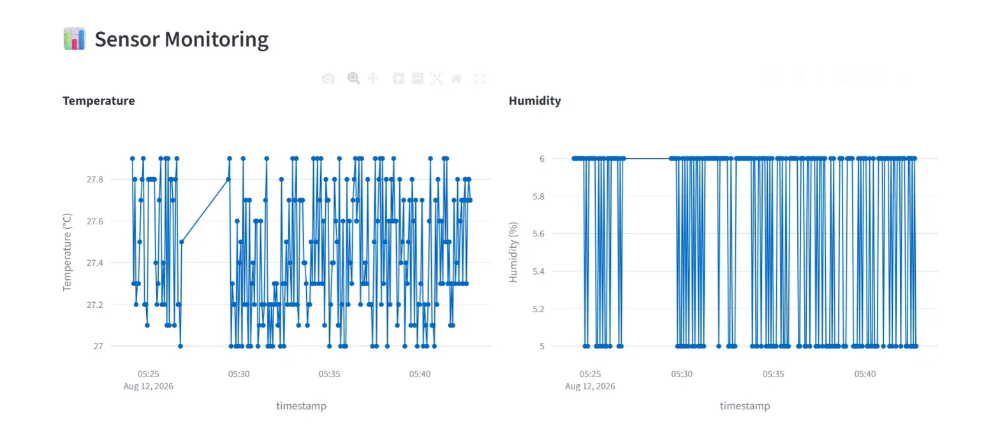
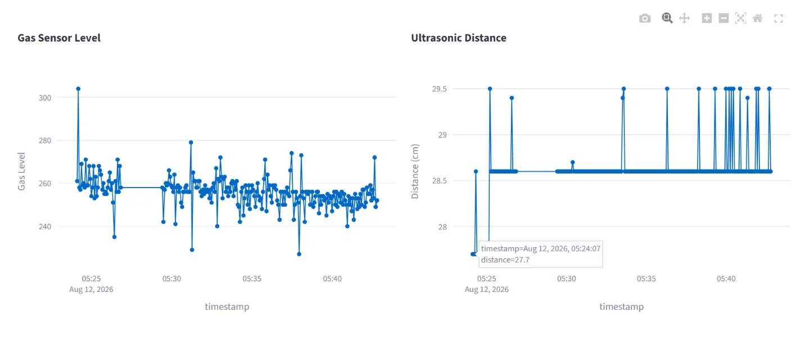

# AES-Enabled Industrial IoT Monitoring and Safety System

A secure embedded Industrial IoT monitoring platform built around an **ESP8266 NodeMCU**, local safety evaluation, **AES-128-CBC** protected telemetry, **MQTT/Mosquitto**, Python-side reception and decryption, **SQLite** persistence, and a **Streamlit** monitoring interface.

The public release is intentionally security-conscious: deployment credentials and reusable secret keys are not included, while the verified firmware, architecture, hardware documentation, project report, and representative dashboard evidence are provided.



## Project Overview

The system continuously acquires temperature, humidity, gas sensor ADC level, and ultrasonic distance measurements. Safety thresholds are evaluated locally on the ESP8266 before telemetry leaves the device. The resulting JSON telemetry is protected with AES-128-CBC using a fresh 16-byte IV per message, Base64-encoded, and published to the MQTT topic `iot/sensors`.

On the receiving side, the encrypted payload is decoded and decrypted, the original JSON is reconstructed, and telemetry is stored in SQLite for monitoring and historical analysis. The Streamlit dashboard provides live status, threshold information, telemetry trends, database visibility, and cryptographic payload inspection.

A separate **Preliminary Edge-AI Security Detection Module** is documented at a high level. Its implementation remains confidential and is not exposed in this public repository.

## Objectives

- Acquire environmental and proximity telemetry on a resource-constrained embedded node.
- Evaluate safety conditions locally rather than depending on the dashboard for the primary decision.
- Protect application telemetry using AES-128-CBC with per-message IVs.
- Transport encrypted telemetry through MQTT/Mosquitto.
- Reconstruct and persist telemetry for historical analysis.
- Provide an engineering-oriented real-time monitoring interface.
- Maintain a clean public release without credentials, reusable keys, or sensitive runtime databases.

## Key Features

- ESP8266 NodeMCU sensor node
- DHT11 temperature/humidity sensing
- MQ-135 gas sensor ADC monitoring
- HC-SR04 ultrasonic distance monitoring
- Touch-based local buzzer silencing
- Green/yellow/red status indication and buzzer alarm
- Local safety threshold evaluation
- JSON telemetry formation
- AES-128-CBC encryption
- PKCS#7 padding
- Fresh 16-byte IV per encrypted message
- `[IV][ciphertext]` packet framing
- Base64 transport encoding
- MQTT publish/subscribe architecture
- SQLite historical storage
- Streamlit monitoring and visualization
- Preliminary Edge-AI security detection documentation

## System Architecture



```text
Sensors
  ↓
ESP8266 NodeMCU
  ↓
Local Safety Evaluation
  ↓
JSON Telemetry
  ↓
PKCS#7 Padding
  ↓
AES-128-CBC + Fresh 16-byte IV
  ↓
[IV][Ciphertext]
  ↓
Base64
  ↓
MQTT / Mosquitto
  ↓
Python Receiver
  ↓
Base64 Decode → IV Extraction → AES-CBC Decryption → PKCS#7 Unpadding
  ↓
JSON Reconstruction
  ↓
SQLite
  ↓
Streamlit Dashboard
```

## Hardware



| Component | Function |
|---|---|
| ESP8266 NodeMCU | Main embedded controller |
| DHT11 | Temperature and humidity |
| MQ-135 | Gas sensor ADC level |
| HC-SR04 | Ultrasonic distance / proximity |
| Touch sensor | Local buzzer silencing |
| Green LED | Normal-state indication |
| Yellow LED | Normal/load-status indication |
| Red LED | Danger indication |
| Buzzer | Audible danger alarm |

See [`hardware/components.md`](hardware/components.md) and [`hardware/pin_configuration.md`](hardware/pin_configuration.md).

## Pin Configuration

| Device | ESP8266 connection |
|---|---|
| DHT11 DATA | D2 / GPIO4 |
| HC-SR04 TRIG | D1 / GPIO5 |
| HC-SR04 ECHO | D5 / GPIO14 |
| MQ-135 AO | A0 |
| Touch sensor | D6 / GPIO12 |
| Green LED | D4 / GPIO2 |
| Red LED | D8 / GPIO15 |
| Yellow LED | D7 / GPIO13 |
| Buzzer | D0 / GPIO16 |

## Safety Monitoring Logic

The firmware evaluates the following final thresholds:

| Parameter | Danger condition |
|---|---|
| Temperature | `> 35.0 °C` |
| Humidity | `> 80.0 %` |
| Gas sensor | `> 1000 ADC` |
| Ultrasonic distance | `0 < distance < 6.0 cm` |

The overall decision is:

```text
dangerDetected =
    temperatureDanger ||
    humidityDanger ||
    gasDanger ||
    distanceDanger
```

An ultrasonic reading of `-1.0 cm` represents no echo / an invalid measurement and does **not** automatically trigger intrusion.

### Local outputs

| State | Green | Yellow | Red | Buzzer |
|---|---:|---:|---:|---:|
| Normal | ON | ON | OFF | OFF |
| Danger | OFF | OFF | ON | ON |

Touch input can silence the buzzer while the danger condition remains active; the red LED remains on.

## Telemetry Format

The firmware generates structured JSON with these fields:

```json
{
  "device_id": "ESP8266_01",
  "temperature": 30.6,
  "humidity": 49.0,
  "gas_level": 852,
  "distance": 57.0,
  "status": "NORMAL"
}
```

`gas_level` is an **ADC level**, not a calibrated ppm concentration.

The firmware uses `NORMAL` for normal operation and `INTRUSION` when the local danger condition is active.

## AES-128-CBC Encryption

The implemented application-layer format is:

```text
Plaintext JSON
      ↓
PKCS#7 padding
      ↓
Fresh 16-byte IV
      ↓
AES-128-CBC
      ↓
[16-byte IV][ciphertext]
      ↓
Base64
      ↓
MQTT payload
```

For CBC:

```text
C₀ = IV
Cᵢ = Eₖ(Pᵢ ⊕ Cᵢ₋₁)
Pᵢ = Dₖ(Cᵢ) ⊕ Cᵢ₋₁
```



**Security note:** AES-CBC provides confidentiality in this design; it does not by itself provide authenticated integrity. The public documentation therefore does not describe CBC as authenticated encryption.

## MQTT Communication

- Broker: Mosquitto or another compatible MQTT broker
- Port: `1883` in the demonstrated configuration
- Topic: `iot/sensors`
- Transport: TCP

The broker address is environment-specific and is deliberately represented by a placeholder in the public firmware.

## Python Receiver and SQLite

The intended verified processing chain is:

```text
MQTT message
  → Base64 decode
  → extract 16-byte IV
  → AES-128-CBC decrypt
  → PKCS#7 unpadding
  → JSON parsing
  → SQLite insertion
```

The public package does **not** include the private receiver source or a live `iot_data.db`. This avoids publishing environment-specific credentials, runtime data, or source that was not part of the verified public-release bundle.

## Streamlit Dashboard

Representative project evidence is included in [`screenshots/`](screenshots/). The demonstrated interface includes:

- Device and MQTT state
- SQLite/database status
- Live telemetry
- Safety threshold comparison
- Sensor trends
- End-to-end security pipeline visualization
- Encrypted MQTT payload inspection
- Decrypted JSON inspection
- Historical telemetry visualization
- Automatic refresh controls

The dashboard is a visualization and analysis layer; the primary safety decision is performed by the embedded firmware.







## Preliminary Edge-AI Security Detection

The project also includes a **Preliminary Edge-AI Security Detection Module** as a separate security-analysis layer.

The documented role is to classify security-related telemetry/communication observations into:

- Legitimate
- Spoofed
- Replayed
- Malformed

The reported project evaluation is **95.0% weighted F1-score** and **8.5 ms inference latency**. These are documented project results, not independently reproducible claims from this public repository.

The following implementation details remain confidential and are intentionally not included:

- Model architecture
- Training source code
- Training dataset
- Proprietary features
- Model parameters
- Model weights
- Internal inference implementation

See [`ai/README.md`](ai/README.md).

## Experimental Evidence

Representative evidence from the demonstrated system includes:

- Normal-operation example around `30.6 °C`, `48–49 %` humidity, gas ADC around `845–852`, and distance around `57 cm`.
- Persistent telemetry history exceeding `6,000` demonstrated records.
- Successful AES-128-CBC protected MQTT telemetry inspection and JSON recovery.

These values are examples from the demonstrated run and are not universal operating limits.





## Installation

### ESP8266 / Arduino IDE

1. Install Arduino IDE.
2. Add the ESP8266 Boards Manager URL:
   `https://arduino.esp8266.com/stable/package_esp8266com_index.json`
3. Open **Boards Manager** and install the ESP8266 Community package.
4. Select **NodeMCU 1.0 (ESP-12E Module)**.
5. Select the correct COM port.
6. Install the libraries used by the firmware:
   - `ESP8266WiFi`
   - `PubSubClient`
   - `DHT sensor library`
   - `Crypto`
   - `AES`
7. Configure Wi-Fi, broker address, and the local 16-byte AES key in your private working copy.
8. Upload the firmware.
9. Open Serial Monitor at `115200` baud.

### MQTT

Run a local or network-accessible Mosquitto broker and make sure the ESP8266 can reach it. The firmware publishes to `iot/sensors` on TCP port `1883` in the demonstrated setup.

### Python / Dashboard

The private Python receiver and dashboard source were not included in this public-release bundle, so package versions are intentionally not guessed. When publishing those source files, generate requirements directly from their actual imports and document the exact run commands.

## Repository Structure

```text
AES-Enabled-Industrial-IoT-Monitoring-and-Safety-System/
├── README.md
├── LICENSE
├── .gitignore
├── firmware/
│   └── ESP8266_Secure_IoT/
│       ├── ESP8266_Secure_IoT.ino
│       └── README.md
├── receiver/
│   └── README.md
├── dashboard/
│   └── README.md
├── ai/
│   └── README.md
├── hardware/
│   ├── components.md
│   └── pin_configuration.md
├── documentation/
│   ├── Project_Report.pdf
│   ├── architecture/
│   │   ├── system_architecture.png
│   │   ├── secure_data_flow.png
│   │   └── aes_cbc_flow.svg
│   └── hardware/
│       └── prototype_hardware.png
├── screenshots/
│   ├── 01_physical_prototype.png
│   ├── 02_dashboard_overview.png
│   ├── 03_secure_data_pipeline.png
│   ├── 04_mqtt_payload_verification.png
│   ├── 05_temperature_humidity_trends.png
│   └── 06_gas_distance_trends.png
└── samples/
    ├── sample_telemetry.json
    └── sample_mqtt_payload.txt
```

## Security Considerations

Before public deployment:

- Never commit a real Wi-Fi SSID/password.
- Never commit the reusable production AES key.
- Never commit MQTT credentials or tokens.
- Avoid committing private broker IP addresses when they are environment-specific.
- Do not commit the live SQLite database when it contains unnecessary or sensitive runtime data.
- AES-CBC should not be described as authenticated encryption.
- Keep proprietary AI implementation details outside the public repository.
- Treat screenshots as public artifacts and check them for credentials or keys before publishing.

## Future Improvements

- Add authenticated encryption such as an AEAD construction where the deployment requirements permit it.
- Add authenticated MQTT/TLS transport and broker access control.
- Introduce secure key provisioning rather than source-level shared-key configuration.
- Add stronger message authenticity/replay protection.
- Publish the receiver/dashboard source once it has been audited and cleared for public release.
- Integrate the confidential security-analysis module only to the extent permitted for public release.

## Documentation

- [`documentation/Project_Report.pdf`](documentation/Project_Report.pdf) — dedicated technical project report
- [`hardware/components.md`](hardware/components.md) — component roles
- [`hardware/pin_configuration.md`](hardware/pin_configuration.md) — exact wiring map
- [`documentation/architecture/`](documentation/architecture/) — system and security-flow diagrams
- [`screenshots/`](screenshots/) — representative system evidence

## Author

**Rishi P.**  
Electronics & Communication Engineering  
Focus: Embedded Systems · IoT · Firmware · Edge Security
